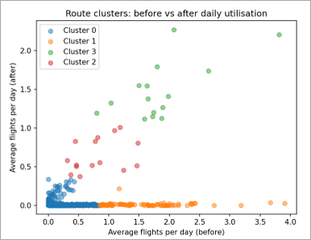
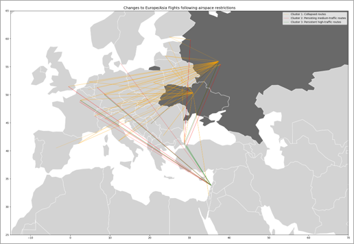

  

  

    <h1 style="margin-top:0;">
      Flight Path Analysis – Impact of Airspace Restrictions
    </h1>

    

      This project analyses historic commercial flight data to examine how
      airspace restrictions introduced in February 2022 affected
      Europe–Asia flight routes.
    

  

---

## Problem

In February 2022, widespread airspace restrictions were introduced across Europe and Russia following the invasion of Ukraine. These restrictions had the potential to significantly disrupt international flight networks.

The aim of this project was to assess whether commercial flight routes between Europe and Asia were structurally affected following the introduction of these restrictions.

---

## Data

The analysis uses publicly available flight movement data published by the Open Performance Data Initiative (OPDI), alongside reference airport data used to map locations geographically.

The dataset covers approximately 15 million flight records between January 2022 and March 2023.

---

## Method

- Built a Python-based ETL pipeline to load and process monthly flight data
- Scoped data to Europe–Asia routes using ICAO location indicators
- Engineered route-level features summarising activity before and after restrictions
- Applied K-means clustering to identify patterns in route behaviour
- Visualised routes geographically to support interpretation

---

## Example outputs

---

## Tools

- Python (pandas, NumPy, scikit-learn)
- matplotlib
- GeoPandas

---

## Outcome

The analysis identified clear structural changes to Europe–Asia flight routes following the restrictions. Several routes collapsed entirely, particularly those involving restricted airspace, while others persisted due to alternative routing or geopolitical factors.

---

## Further work

- Extend the analysis to assess delay patterns for rerouted flights
- Compare results with additional geopolitical disruption scenarios

---

## Notes

This project was completed for academic purposes using publicly available data.
